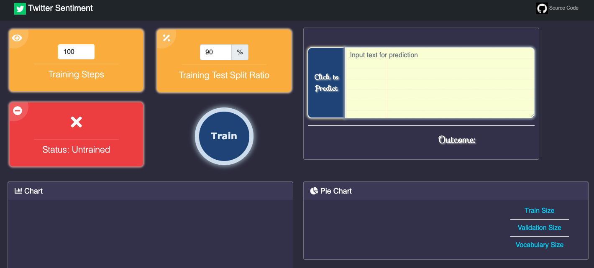
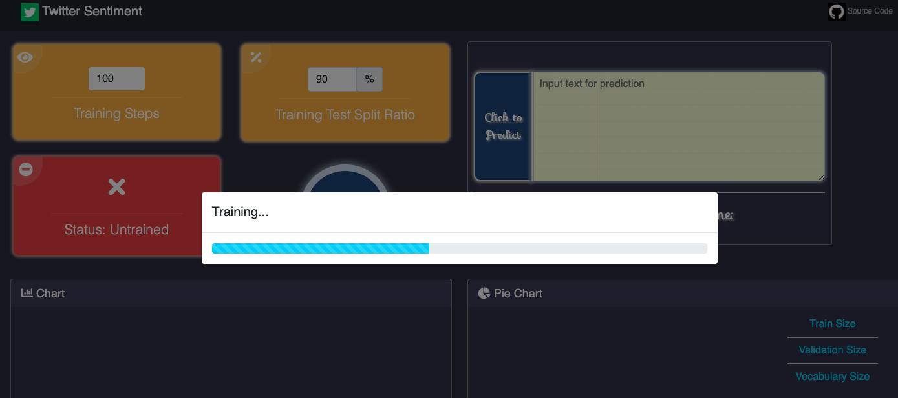
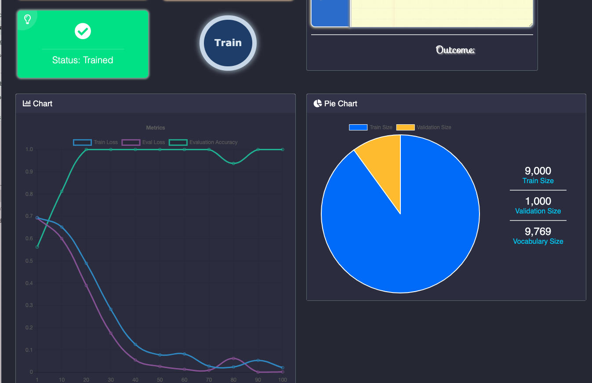
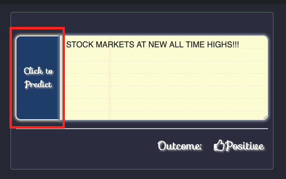
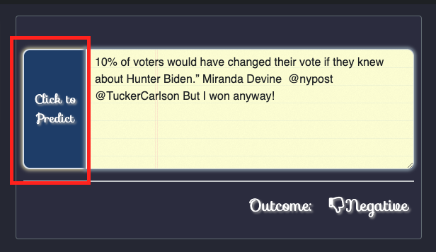

# Twitter-Sentiment-Tool

[django](https://github.com/django/django)
[trax](https://github.com/google/trax)

## Initialize environment 


```
./run.sh # if on linux environment
```

Above scirpt does the following steps:

- create virtual environment
- download required library 
- activate virtual environment
- start Django server on local computer

Then open a browser, go to [127.0.0.1:8000/](http://127.0.0.1:8000/]

## Train Model 

When open the webpage at the first time, it shows as Untrained. 



Then can ajdust *training steps* and *training test split ratio*, and click *Train button* to train the model. 



After training, charts, traing size, validation size, vocabulary size, and status bar will be updated. 





## Make Prediction

After training the model, can input text and click to predict as follow





